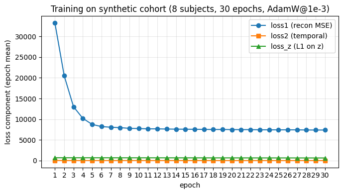
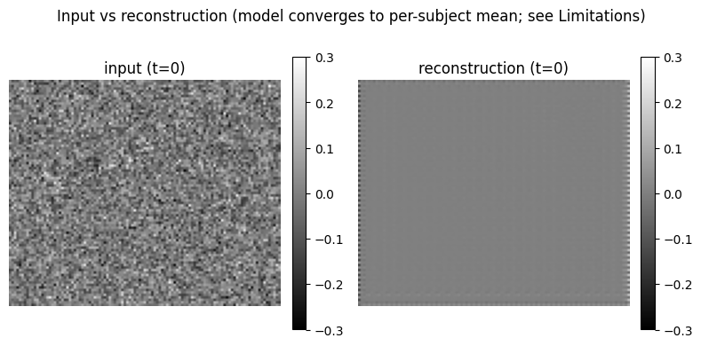
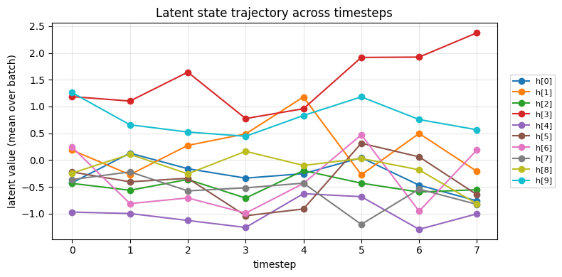

# RecVAE — Recurrent 3D-Conv VAE for fMRI (Alzheimer's / ADNI)

> A PyTorch reference implementation plus an 18-lesson tutorial series for
> modelling temporal fMRI data with deep variational autoencoders.

[](https://github.com/YuZh98/VAE-fMRI-Alzheimer/actions/workflows/tutorials.yml)
[](LICENSE)
[](https://www.python.org/)
[](https://pytorch.org/)
[](https://colab.research.google.com/github/YuZh98/VAE-fMRI-Alzheimer/blob/main/notebooks/RecVAE_on_synthetic.ipynb)

## What it is

A recurrent 3D-conv VAE for resting-state fMRI volumes, in the same
family as Kim et al. (2021) but with a linear latent transition solved
in closed form by ridge regression rather than learned by SGD. Ships
with a synthetic data path so you can run it without ADNI access; every
example fits on a laptop CPU. For neuroimaging context see
[`docs/background/fmri_101.md`](docs/background/fmri_101.md).

## Quickstart

```bash
git clone https://github.com/YuZh98/VAE-fMRI-Alzheimer
cd VAE-fMRI-Alzheimer
python -m venv .venv && source .venv/bin/activate
pip install -e ".[dev]"
pytest -v                                              # 36 tests, ~5-20s, CPU-only
python tutorials/15_train_end_to_end/train_tiny.py     # synthetic, ~3s
```

The directory is `VAE-fMRI-Alzheimer`; the package imports as `recvae`.
For a full end-to-end run on synthetic data, see
[`notebooks/RecVAE_on_synthetic.ipynb`](notebooks/RecVAE_on_synthetic.ipynb).

## Tutorials

[`tutorials/`](tutorials/) has 18 hands-on lessons covering tensor
shapes, 3D-conv arithmetic, the reparameterization trick, recurrent
rollouts, alternating optimization, reproducibility, testing DL code,
and research extensions. Each lesson has a short README and at least
one runnable script.

## Visuals

| Loss curve | Reconstruction | Latent trajectory |
|---|---|---|
|  |  |  |

Generated from `tools/make_figures.py` (30 epochs of AdamW@1e-3 on 8
synthetic subjects, CPU, ~30s). The reconstruction panel shows that on
this minimal setup the decoder converges to roughly the per-subject
mean — recovering high-frequency voxel structure needs a wider decoder
and a different output activation. See the Limitations section.

## Architecture

A 3D-convolutional VAE with a latent recurrence:

```
                    ┌──────────────┐
   x_t ─────────────► 3D-CNN encode├──┐
   (1,91,109,91)    └──────────────┘  │  (B, 100)
                                      ▼
                       ┌────────────────────────────┐
   h_{t-1} ───────────►│  hidden2mu, hidden2log_var │
   (B, 10)             └────────────────────────────┘
                                      │
                                      ▼      ε ~ N(0, I)   (reparam)
                                 mu_h, log_var_h ────────────┐
                                                              ▼
                                                      h_t = mu_h + σ_h ε   (B, 10)
                                                              │
                                       z_s (subject noise) ───┤
                                                              ▼
                                                      h_t + z_s  ─────────┐
                                                                          ▼
                                                              ┌─────────────────────┐
                                                              │  3D-CNN decode      │
                                                              └─────────────────────┘
                                                                          │
                                                                          ▼
                                                                  μ_t  (B,1,91,109,91)

   Linear temporal prior: g(h) = h F^T  →  used in loss term  ‖h_t − g(h_{t-1})‖^2
```

For each subject's fMRI sequence (T=120 timepoints), the encoder
collapses each volume to a 100-dim feature; the inference head combines
that with `h_{t-1}` to produce a Gaussian posterior over `h_t`; the
decoder reconstructs the volume from `h_t + z_s`, where `z_s` is a
subject-specific noise vector, L1-regularized for sparsity. The
transition matrix `F` is re-solved every epoch in closed form by ridge
regression on the accumulated posterior trajectory; everything else
(encoder, inference head, decoder, `z_s`) is trained by SGD.

Design rationale: [`docs/background/this_models_design.md`](docs/background/this_models_design.md).

## Loss

| Term     | Form                                    | How it's optimized       |
|----------|-----------------------------------------|--------------------------|
| `loss1`  | Per-volume reconstruction MSE / σ_x²    | SGD                      |
| `loss2`  | ‖h_t − g(h_{t-1})‖² / σ_h² (temporal)   | SGD                      |
| `loss_z` | λ_z · ‖z‖₁ (subject-noise sparsity)     | SGD                      |
| `loss_F` | ρ · ‖F‖_F² (reported, not back-propped) | Closed form (ridge)      |

`loss2` is an MSE proxy for the temporal prior, not the VAE KL divergence:
this is MAP-style point estimation of the latent path rather than full
variational inference (see Known limitations).

## Repository layout

```
VAE-fMRI-Alzheimer/
├── recvae/                  # main Python package (extracted from notebooks)
│   ├── config.py            # Config dataclass — all hyperparameters
│   ├── data.py              # NIfTI loading, normalization, Dataset, DataLoader
│   ├── model.py             # RecVAEModel (encoder/decoder/inference/F update)
│   ├── train.py             # fit() and evaluate()
│   └── utils.py             # set_seed, device picker, DeviceDataLoader
├── tutorials/               # 18-lesson hands-on series (synthetic data, CPU-only)
├── examples/                # short end-to-end driver scripts
├── docs/                    # background notes (fMRI 101, design rationale, related work)
├── notebooks/
│   ├── RecVAE_on_fMRI.ipynb       # canonical driver (uses recvae package)
│   ├── RecVAE_on_synthetic.ipynb  # synthetic-data end-to-end demo
│   └── Input_images.ipynb         # data-inspection helpers
├── tests/                   # pytest suite (36 tests, ~5-20s, CPU-only)
├── legacy/                  # archived earlier iterations (V1–V4)
├── pyproject.toml           # PEP 621 metadata + pytest config
├── requirements.txt         # runtime deps
├── requirements-dev.txt     # + pytest, nbstripout
├── LICENSE                  # Apache-2.0
└── CITATION.cff             # how to cite this repo
```

## Hyperparameters

All in [`recvae/config.py`](recvae/config.py). Defaults match the canonical
notebook (RecVAE_on_fMRI.ipynb / Version4.ipynb):

| Field           | Default | Meaning                                         |
|-----------------|---------|-------------------------------------------------|
| `enc_out_dim`   | 100     | Encoder output dim before inference head        |
| `latent_dim`    | 10      | Posterior latent state dim, also the subject-noise dim (`z_vectors` shape `(N_train, latent_dim)`) |
| `tol_time`      | 120     | Truncate every fMRI sequence to this many points|
| `sig_x/sig_h/sig_z` | 1.0 | Fixed observation/process noise scales          |
| `rho`           | 0.1     | Ridge penalty for closed-form F update          |
| `lambda_z`      | 10.0    | L1 weight on subject noise                      |
| `batch_size`    | 4       |                                                 |
| `learning_rate` | 1e-6    | SGD lr                                          |
| `epochs`        | 500     |                                                 |
| `seed`          | 2022    |                                                 |

## Known limitations

The package preserves the original notebook's training math exactly,
including a few choices that need an owner decision before they change:

- **No proper train/test split.** The original `test_loader` wraps the
  same dataset as `train_loader`, so reported reconstruction losses are
  training losses. Subject-level k-fold CV is needed before any
  quantitative claim; the utility exists at
  `recvae.evaluation.split_subjects`.
- **`loss2` is MSE, not KL.** The canonical ELBO has
  `KL(q(h_t|·) || p(h_t|h_{t-1}))`; the current loss does point
  estimation on the latent path. See `TODO(research)` in
  [`recvae/model.py`](recvae/model.py) and the opt-in `KLRecVAELoss` in
  `recvae/losses.py`.
- **Noise scales are fixed, not learned.** Making `sig_x/sig_h/sig_z`
  trainable would let the model calibrate its own loss weighting.
- **Per-subject min-max normalization** destroys absolute-intensity
  differences across subjects.
- **SGD@1e-6 is slow.** AdamW@~1e-4 with a scheduler is likely to
  converge faster.
- **No KL annealing / β-VAE.** Moot without an explicit KL term.
- **Decoder capacity is small.** With default channels `[4, 8, 16, 32]`
  and a `Tanh` output applied to per-subject min-max-normalized inputs,
  the decoder converges to ~constant-mean output and does not recover
  per-voxel structure (verified by overfit-a-single-volume test:
  Pearson(x, mu) ≈ 0.03 after 500 epochs of AdamW). Widening to
  `[16, 32, 64, 128]` and dropping the final `Tanh` is the obvious fix
  but changes the model contract; see `docs/background/this_models_design.md`
  for the empirical findings and `examples/wide_decoder.py` for a sketch.

This is a reference implementation and teaching artifact, not a
peer-reviewed method or clinical tool. For stronger baselines on ADNI
see [`docs/background/vae_for_neuroimaging.md`](docs/background/vae_for_neuroimaging.md).

## Maintainers

- Hugh Zheng ([@YuZh98](https://github.com/YuZh98)) — primary author and maintainer.

Open an issue if you'd like to be added as a co-maintainer.

## Citation

If you use this code in research or teaching, please cite via the GitHub
"Cite this repository" button (driven by [`CITATION.cff`](CITATION.cff)).

## Acknowledgements

Subject scans come from the [ADNI](http://adni.loni.usc.edu/) study; data
use requires acceptance of the ADNI Data Use Agreement.
